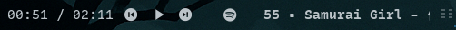
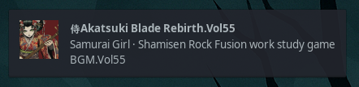
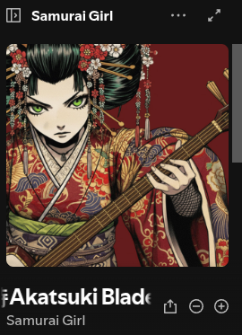
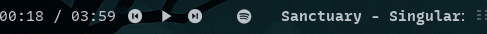
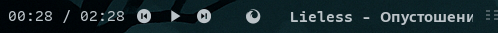
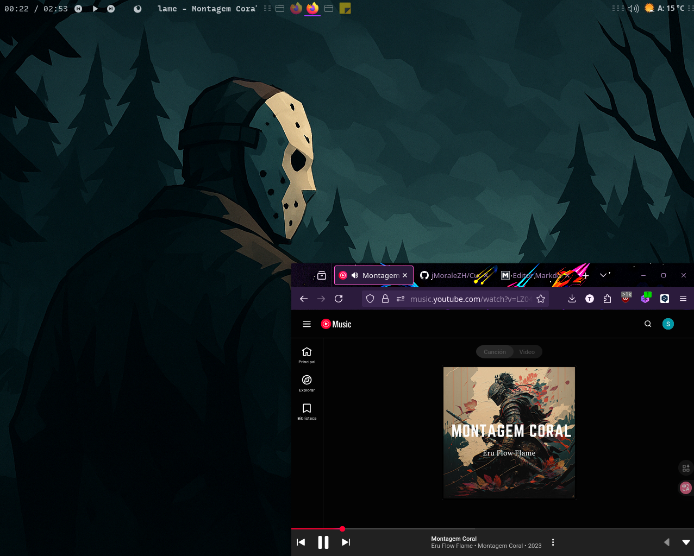

<p align="center">
  
</p>

<h1 align="center">🎧 XFCE Universal Multimedia Controls</h1>

<p align="center">
  by <strong>BearyTECH</strong>
</p>


# 🎧 XFCE Universal Multimedia Controls (Genmon + Playerctl)

Controles multimedia universales para XFCE usando Genmon y playerctl.
Permite controlar música y video sin abrir las aplicaciones:

- Spotify

- YouTube Premium (Firefox / Chromium)

- MPV

Cualquier reproductor compatible con MPRIS
Minimalista, rápido, modular y 100% compatible con cualquier distro Linux.
Diseñado con Nerd Fonts, scroll suave y scripts independientes para cada acción.

---
## 📸 Capturas de pantalla
##### 📸 Captura general del panel


##### 🎵 Notificación


##### 🎵 Spotify


##### 🐧 Capturas Firefox



---
## 🧩 Características

 - Control universal: Spotify + YouTube Premium + MPV
- Botones Previous / Play-Pause / Next
- Título con scroll real (con detección de largo y desplazamiento automático)
- Ícono dinámico según reproductor activo
- Color según estado (Playing / Paused)
- Totalmente modular (cada script independiente)
- Solo usa playerctl + NerdFonts
- Perfecto para XFCE Panel + Genmon
- Incluye servicio systemd para notificaciones de Spotify con portada
- Súper liviano, sin dependencias extra

---
## 📦 Estructura del proyecto
```
genmon-multimedia/
│
├── README.md
├── LICENSE
├── .gitignore
├── install.sh
│
├── scripts/
│   ├── gm_player_icon.sh
│   ├── gm_title_scroll.sh
│   ├── gm_prev.sh
│   ├── gm_playpause.sh
│   ├── gm_next.sh
│   └── spotify-watch.sh
│
├── helpers/
│   └── spotify-cover.sh
│
├── systemd/
│   └── spotify-cover.service
│
└── _screenshots/
```
## 🔧 Requisitos

- playerctl

- Nerd Fonts (JetBrainsMono NF recomendado)

- XFCE Panel con soporte Genmon

- Spotify (solo si deseas notificaciones con portada)

- systemd user habilitado (para el watcher de Spotify)

---
## 📥 Instalación
1. Clonar el repositorio
```
git clone https://github.com/tuusuario/genmon-multimedia.git
cd genmon-multimedia
```
2. Instalar scripts
```
sudo cp scripts/*.sh /usr/local/bin/
sudo chmod +x /usr/local/bin/*.sh
```
---
## 🖥 Agregar módulos a XFCE Panel
```
Panel → Preferencias → Elementos → + Añadir
```
Seleccionar Monitor genérico (Genmon) y agregar los siguientes:
| Módulo                | Script                            |
| --------------------- | --------------------------------- |
| Icono del reproductor | /usr/local/bin/gm_player_icon.sh  |
| Título con scroll     | /usr/local/bin/gm_title_scroll.sh |
| Botón Previous        | /usr/local/bin/gm_prev.sh         |
| Botón Play/Pause      | /usr/local/bin/gm_playpause.sh    |
| Botón Next            | /usr/local/bin/gm_next.sh         |
| Botón Time            | /usr/local/bin/gm_time.sh         |
---
## 🔔 Notificaciones de Spotify (opcional)
Instalar servicio systemd
```
mkdir -p ~/.config/systemd/user
cp systemd/spotify-cover.service ~/.config/systemd/user/
systemctl --user daemon-reload
systemctl --user enable --now spotify-cover.service
```

El servicio usa:

```
spotify-watch.sh → playerctl metadata --follow  
spotify-cover.sh → genera la notificación con carátula
```
---
## 🎚️ Funcionamiento

La barra XFCE queda así:
```
[ Tiempo ] [⏮] [⏯] [⏭] [Ícono]  [ Título con scroll ]   
```
Si está sonando algo → se muestra el reproductor e icono

Si el título es largo → scroll automático
```
PREV / PLAY / NEXT funcionan con Spotify + YouTube Premium + MPV
```
---
## ⭐ Licencia
MIT License

Si te gusta este proyecto, ¡déjale una estrellita! ⭐
Pull requests y sugerencias son bienvenidas.

---
## 🙌 Créditos
Proyecto creado en Linux XFCE Arch Linux 🎧🐧

---
## 💬 NOTA FINAL
Este proyecto es ideal para:
- Escritorios minimalistas
- Usuarios de XFCE que quieren multimedia avanzado
- Paneles limpios tipo macOS / i3 / polybar
##### 🐧 Desktop



